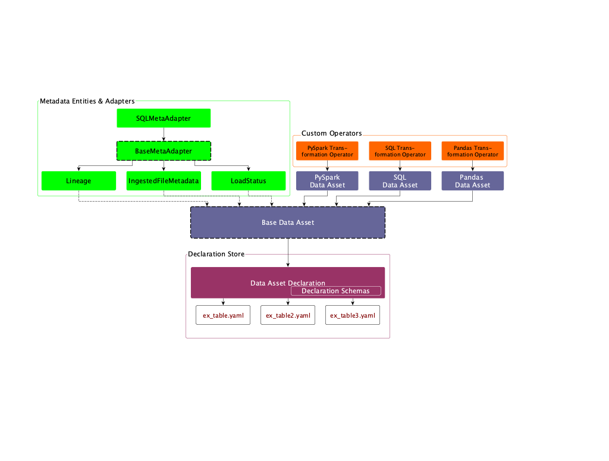

# airtunnel

Airtunnel is a means of supplementing [Apache Airflow](https://github.com/apache/airflow), a platform for workflow
automation in Python which is angled at analytics/data pipelining. It was born out of years of project experience in
data science, and the hardships of running large data platforms in real life businesses. Hence, Airtunnel is both a
set of principles (read more on them [in the official airtunnel announcement](https://medium.com)) and a lightweight
Python library *to tame your airflow*!
## Why choose airtunnel? Because you will…
:heart: …stop worrying and love the uncompromised consistency

:rocket: …need a clean codebase with separated concerns to be scalable

:memo: …get metadata for ingested files, load status and lineage out-of-the-box

:running: …have it up and running in minutes

:beer: …spend less time debugging Airflow DAGs doing worthwhile things instead

## Getting started

## Table of Contents
- [Installation requirements](#installation-requirements)
- [Installation and setup](#installation-and-setup)
- [Tutorial: loading the university data model](#tutorial-loading-the-university-data-model)
- [Known limitations](#known-limitations)
- [Design Principles](#design-principles)
- [Architecture: modules & classes](#architecture-modules--classes)
- [Contributing to Airtunnel](#contributing-to-airtunnel)

### Installation requirements
- **Python >= 3.6 and Airflow >=1.10**: we assume Airtunnel is implemented best early on in a project, which is why going
with a recent Python and Airflow version makes the most sense. In the future we might do more tests and include coverage
for older Airflow versions.

### Installation and setup
1) We suppose you have installed Apache Airflow in a Python virtual environment. From there, simply do a 
`pip install airtunnel` to get the package.

2) Configure your codebase according to the Airtunnel principles: You need to add three folders for a
declaration store, a scripts store and finally the data store:

    2.1) The declaration store folder has no subfolders. It is where your data asset declarations
     (YAML files) will reside
     
    2.2) The scripts store folder is where all your Python & SQL scripts to process data assets will reside.
     It should be broken down by subfolders `py` for Python scripts and `sql` for SQL scripts. Please further add
     subfolders `dml` and `ddl` into the `sql` script folder.
     
    2.3) The data store folder follows a convention as well. 

3) Configure Airtunnel by extending your existing `airflow.cfg`

    3.1) Add the configuration section `[airtunnel]` in which,
    you need to add three configuration keys.

    3.2) add `declarations_folder` which takes the absolute path to the folder you set up in 2.1
    
    3.3) add `scripts_folder` which takes the absolute path to the folder you set up in 2.2
 
    3.4) add `data_store_folder`, which takes the absolute path to the folder you set up in 2.3
    for your data store

## Tutorial
**Check out the tutorial [here](docs/tutorial.md)**

## Known limitations
Airtunnel is still a very young project - there are several known limitations:
- the PySparkDataAsset is not implemented
- interaction with a local physical data store has been built out using custom operators as a PoC and Airtunnel testing
environment – in the near future, cloud storage providers should be supported
- lineage collection for SQL is implemented fairly simplistic - it won't work well for queries with i.e. CTE at the top
- declaration properties for data assets are at a common, minimum level - but might in the future be extended a lot. It's
suggested to, in the meantime, leverage the non-validated "extra" section-key in the YAML, to declare additional properties Airtunnel does
not cover.

In general Airtunnel does not attempt to solve any use-case; rather, we like to stay open for extensions provided on the
user side. As such, any of the shortcomings mentioned aboved can be realized through subclassing existing Airtunnel
classes.

## Design Principles
Taken from the [the official airtunnel announcement](https://medium.com).

### Uncompromised Consistency

**todo: add finished section of medium article in here**

### Declarative first and low-code redundancy

**todo: add finished section of medium article in here**

### Metadata driven

**todo: add finished section of medium article in here**

## Architecture: modules & classes
The airtunnel architecture in terms of Python modules and classes is as follows:

- **Data Assets**: The data asset abstraction is at the heart of airtunnel - its base class bundles several common
operations, like finding data asset paths (by strictly inferring them from data asset names, and DAG-execution dates, if
versioned). Therefor by following the convention, the unique data asset name suffices to instantiate a data asset.
The BaseDataAsset is subclassed by: *Pandas Data Asset*, *SQL Data Asset* and *PySpark Data Asset*. The striking difference
there being obviously the means of accessing/processing the data asset instance at hand. For that the core abstract
functions `rebuild_for_store` and `retrieve_from_store` are implemented differently.

    - *PandasDataAsset*: To rebuild from store, this class will check in the Airtunnel scripts store in the subfolder
    `py` for a Python module named `[data_asset_name].py`. It will dynamically import this module and will expect and 
    call the function `rebuild_for_store(asset: PandasDataAsset, airflow_context)` to perform the rebuilding. As we
    want this to be mostly run by Airflow DAGs, we pass in the Airflow context to be able to leverage that.
     
    - *SQLDataAsset*: This data asset class will take an Airflow `DbApiHook` instance in its constructor in addition to
    the data asset name. It will leverage this hook for all operations in interaction with the database where
    this data asset resides. To rebuild from store, it will dynamically fetch SQL scripts from the scripts store under
    the subfolder SQL in each `ddl` and `dml` respectively, that are named as `[data_asset_name].sql`.
    
    - *PySparkDataAsset*: Similar to PandasDataAsset, but would work with `pyspark.sql.DataFrame` - to be developed

- **Data Asset Declarations**: To safely interact with the declaration store made up of YAML files, the class 
`DataAssetDeclaration` wraps all operations. The entrypoint to it is simply by calling the constructor with the name
of the data asset one would like to retrieve declarations for. Then, the YAML file is fetched and validated using 
several defined `DeclarationSchemas`, which make use of the helper library [schema](https://github.com/keleshev/schema).

- **Metadata Entities & Adapter**: Airtunnel attempts to make Airflow metadata-driven. To accomplish this, we add two
concepts: metadata entities (the types of metadata information we want to interact with) and metadata adapters
 (means of persistently storing and retrieving metadata entities). As of now, Airtunnel adds metadata entities `Lineage`,
 `LoadStatus` and `IngestedFileMetadata` which should be self-explanatory. The current sole implementation of
 `BaseMetaAdapter` is `SQLMetaAdapter`, which takes an Airflow `DbApiHook` and uses SQLAlchemy to read/write metadata.
 We believe it makes a lot of sense to simply store this metadata on the Airflow DB, to have everything in one place.
 This class model though is intended to, by subclassing, to read/write metadata using other means.
- **Custom Operators**: Airtunnel ships various custom operators; the most important ones for you to know being:
`PandasTransformationOperator`, `SQLTransformationOperator` and `PySparkTransformationOperator` that relate one-by-one
to the corresponding data asset types introduced earlier. They are very lightweight and do what you can guess from their
name: each one is instantiated (as part of a DAG) with an Data Asset instance of their type and on operator execute,
will call the `rebuild_for_store` function, with the current Airflow context as a parameter. 
*Other custom operators Airtunnel provides*, that interact with the file-based local physical data store, are:
  - SourceFileIsReadySensor
  - IngestOperator
  - StagingToReadyOperator
  - IngestArchiveOperator
  - DataAssetArchiveOperator
  
  To interact with Airtunnel's metadata model, there are sensors `AwaitLoadStatusSensor` (pokes for an data asset to be
  updated in a recent specified timedelta) and `AwaitAssetAncestorsUpdatedSensor` (using lineage, pokes for updates on
  a Data Asset's ancestors). These can help build out more pull-based workflows, if you do not want/or can't leverage
  Airflow's push-based approaches, like DAG triggering.

  Additionally there is `SQLOperator`, which allows you to run generic SQL scripts from the scripts store using an Airflow
`DbApiHook` – good for maintenance scripts that are not Data Asset centered.

## Contributing to Airtunnel
We love any contributions, be it feedback, issues or PRs on GitHub!
