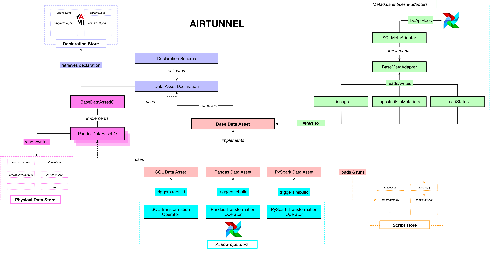

Architecture & classes
======================

The Airtunnel architecture in terms of Python modules and classes is as
follows: |airtunnel-arch|

(`click to enlarge architecture`_)

Data Assets
~~~~~~~~~~~
The data asset abstraction is at the heart of
Airtunnel - its base class bundles several common operations, like
finding data asset paths (by strictly inferring them from data asset
names, and DAG-execution dates, if versioned). Therefor by following
the convention, the unique data asset name suffices to instantiate a
data asset. The BaseDataAsset is subclassed by: *Pandas Data Asset*,
*SQL Data Asset* and *PySpark Data Asset*. The striking difference
there being obviously the means of accessing/processing the data
asset instance at hand. For that the core abstract functions
``rebuild_for_store`` and ``retrieve_from_store`` are implemented
differently.

   -  *PandasDataAsset*: To rebuild from store, this class will check in
      the Airtunnel scripts store in the subfolder ``py`` for a Python
      module named ``[data_asset_name].py``. It will dynamically import
      this module and will expect and call the function
      ``rebuild_for_store(asset: PandasDataAsset, airflow_context)`` to
      perform the rebuilding. As we want this to be mostly run by
      Airflow DAGs, we pass in the Airflow context to be able to
      leverage that.

   -  *SQLDataAsset*: This data asset class will take an Airflow
      ``DbApiHook`` instance in its constructor in addition to the data
      asset name. It will leverage this hook for all operations in
      interaction with the database where this data asset resides. To
      rebuild from store, it will dynamically fetch SQL scripts from the
      scripts store under the subfolder SQL in each ``ddl`` and ``dml``
      respectively, that are named as ``[data_asset_name].sql``.

   -  *PySparkDataAsset*: Similar to PandasDataAsset, but would work
      with ``pyspark.sql.DataFrame`` - to be developed

Data Asset Declarations
~~~~~~~~~~~~~~~~~~~~~~~

To safely interact with the declaration
store made up of YAML files, the class ``DataAssetDeclaration`` wraps
all operations. The entrypoint to it is simply by calling the
constructor with the name of the data asset one would like to
retrieve declarations for. Then, the YAML file is fetched and
validated using several defined ``DeclarationSchemas``, which make
use of the helper library `schema`_.

.. _schema: https://github.com/keleshev/schema

.. _click to enlarge architecture: _static/assets/airtunnel-arch.png

Metadata Entities & Adapter
~~~~~~~~~~~~~~~~~~~~~~~~~~~
Airtunnel attempts to make Airflow
metadata-driven. To accomplish this, we add two concepts: metadata
entities (the types of metadata information we want to interact with)
and metadata adapters (means of persistently storing and retrieving
metadata entities). As of now, Airtunnel adds metadata entities
``Lineage``, ``LoadStatus`` and ``IngestedFileMetadata`` which should
be self-explanatory. The current sole implementation of
``BaseMetaAdapter`` is ``SQLMetaAdapter``, which takes an Airflow
``DbApiHook`` and uses SQLAlchemy to read/write metadata. We believe
it makes a lot of sense to simply store this metadata on the Airflow
DB, to have everything in one place. This class model though is
intended to, by subclassing, to read/write metadata using other
means.

Custom Operators
~~~~~~~~~~~~~~~~
Airtunnel ships various custom operators; the
most important ones for you to know being:
``PandasTransformationOperator``, ``SQLTransformationOperator`` and
``PySparkTransformationOperator`` that relate one-by-one to the
corresponding data asset types introduced earlier. They are very
lightweight and do what you can guess from their name: each one is
instantiated (as part of a DAG) with an Data Asset instance of their
type and on operator execute, will call the ``rebuild_for_store``
function, with the current Airflow context as a parameter. *Other
custom operators Airtunnel provides*, that interact with the
file-based local physical data store, are:

-  SourceFileIsReadySensor
-  IngestOperator
-  StagingToReadyOperator
-  IngestArchiveOperator
-  DataAssetArchiveOperator

To interact with Airtunnel's metadata model, there are sensors
``AwaitLoadStatusSensor`` (pokes for an data asset to be updated in a
recent specified timedelta) and ``AwaitAssetAncestorsUpdatedSensor``
(using lineage, pokes for updates on a Data Asset's ancestors). These
can help build out more pull-based workflows, if you do not want/or
can't leverage Airflow's push-based approaches, like DAG triggering.

Additionally there is ``SQLOperator``, which allows you to run
generic SQL scripts from the scripts store using an Airflow
``DbApiHook`` – good for maintenance scripts that are not Data Asset
centered.